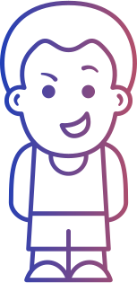
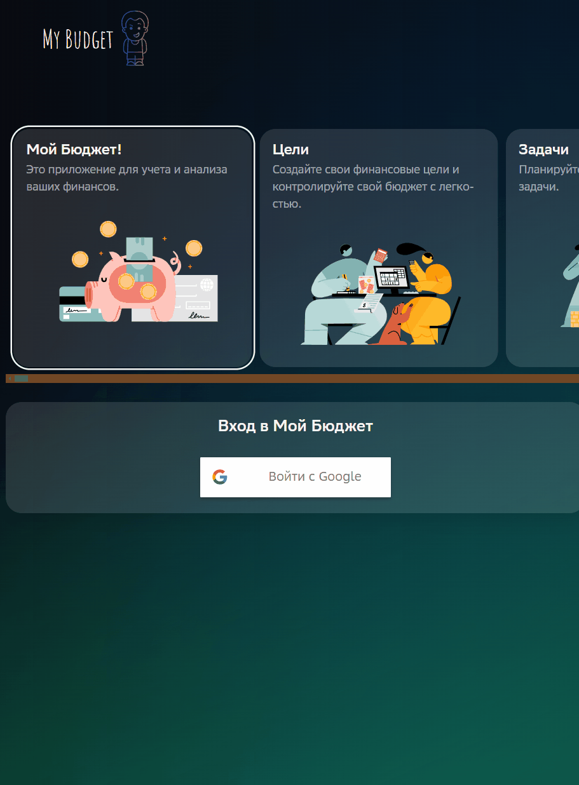
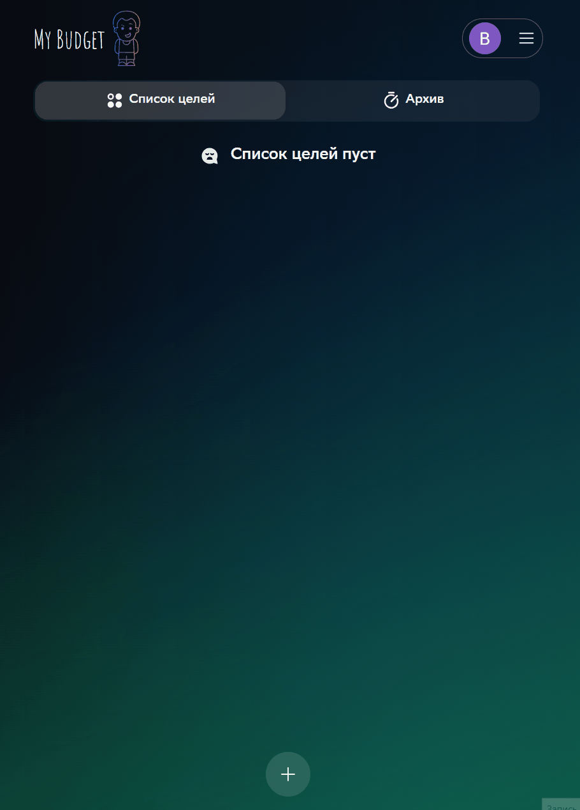
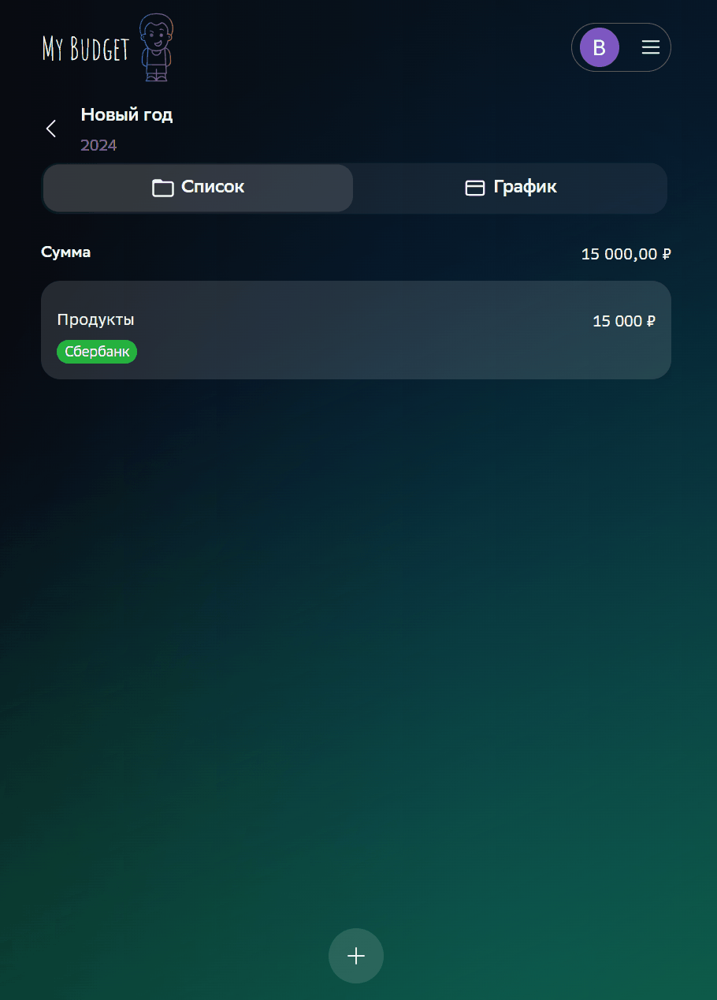
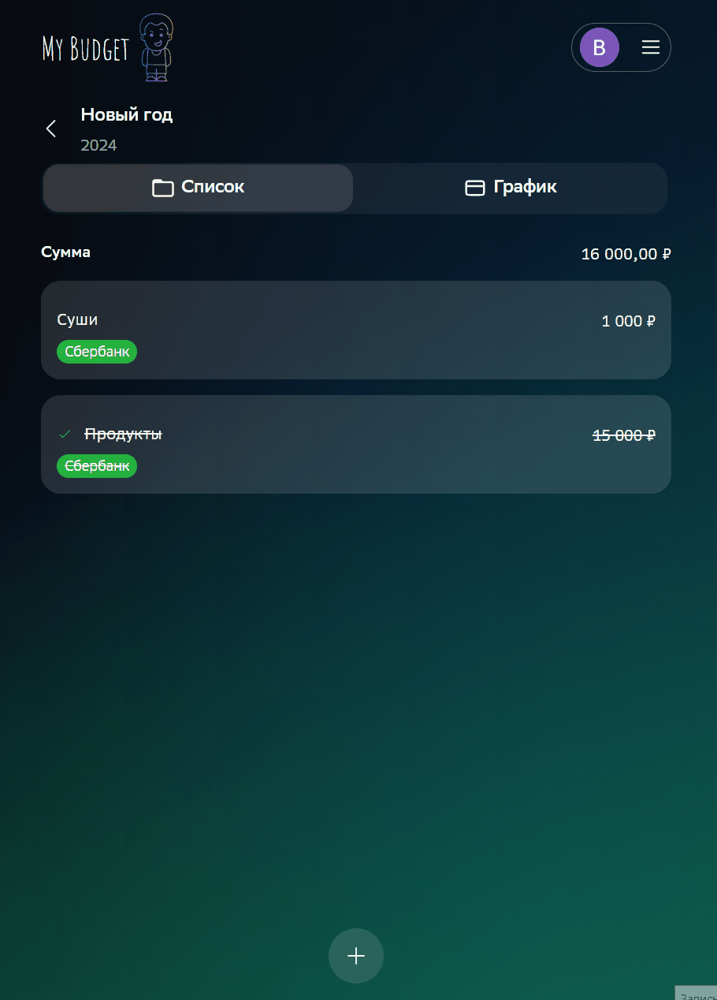

<div>
<h1 align="center">My Budget 
</h1>
</div>
<h2 align="center">Это приложение для планирование бюджета</h2>

| Прод        |         https://my-budget-space.vercel.app/                                                                                                        |
|-------------| ------------------------------------------------------------------------------------------------------------------- |
| StoryBook   | https://65dddade323aed28d6d7f21d-qkjenvxeqb.chromatic.com/?path=/story/components-addbutton--add-button-story       |

| Package                                                                                                       | Version                                                                                                              |
|---------------------------------------------------------------------------------------------------------------|----------------------------------------------------------------------------------------------------------------------|
|        |    20        |
|            | 10.2.4 |
|  | 18.2.0 |
|           | 14.1.4 |
|          | 5.12.1 |
|        | 1.4.0 |

<h2 >Demo:</h3>
<h3 >Авторизация</h4>
</h1>
<h3 >Добавление цели</h4>
</h1>
<h3 >Отметить задачу выполненно</h4>
</h1>
<h3 >Прочий функционал</h4>
</h1>
</h1>


<h2>Установка</h2>
<h3>Шаг 1:</h3>

```
    npm i
```
<h3>Шаг 2:</h3>
```
    создайте .env файл и скопируйте туда значения из  .env.example
```
<h3>Шаг 3:</h3>
```
    npm run dev
```

⚠️ Если вы хотите авторизацю через Google, вам необходимо добавить GOOGLE_SECRET, GOOGLE_CLIENT_ID	
получить можно тут
https://console.cloud.google.com/apis/credentials
А по зашит NEXT_PUBLIC_TEST_USER_ID пользователь будет тестовый. 